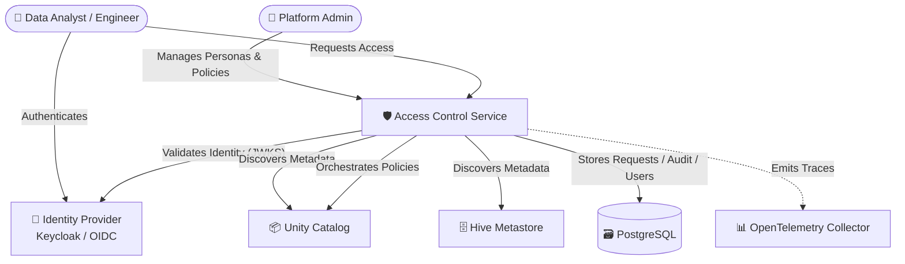
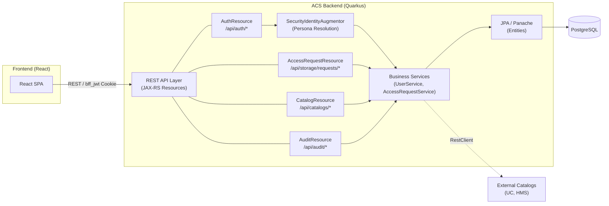
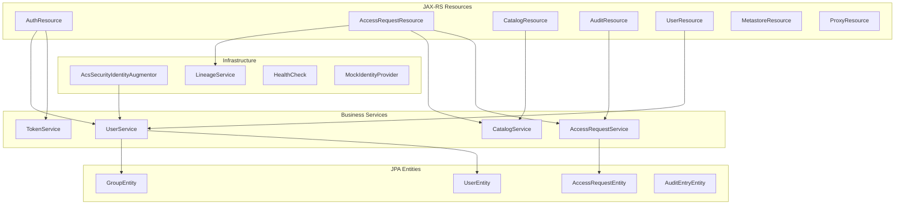
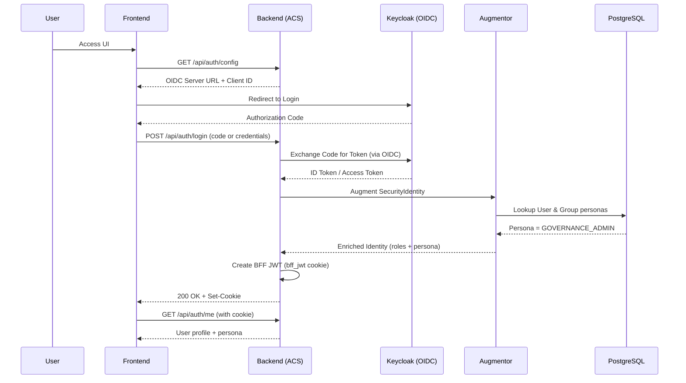
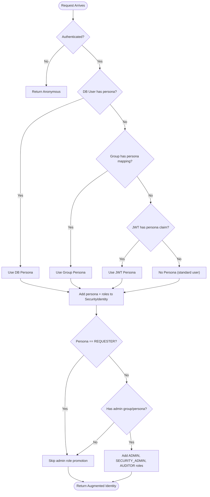
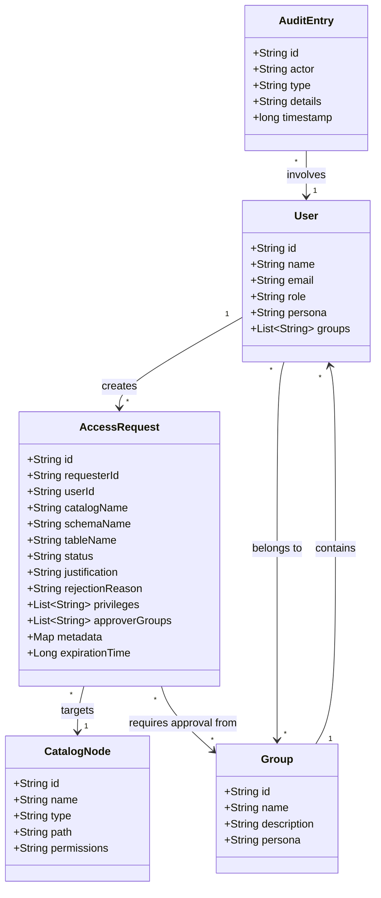
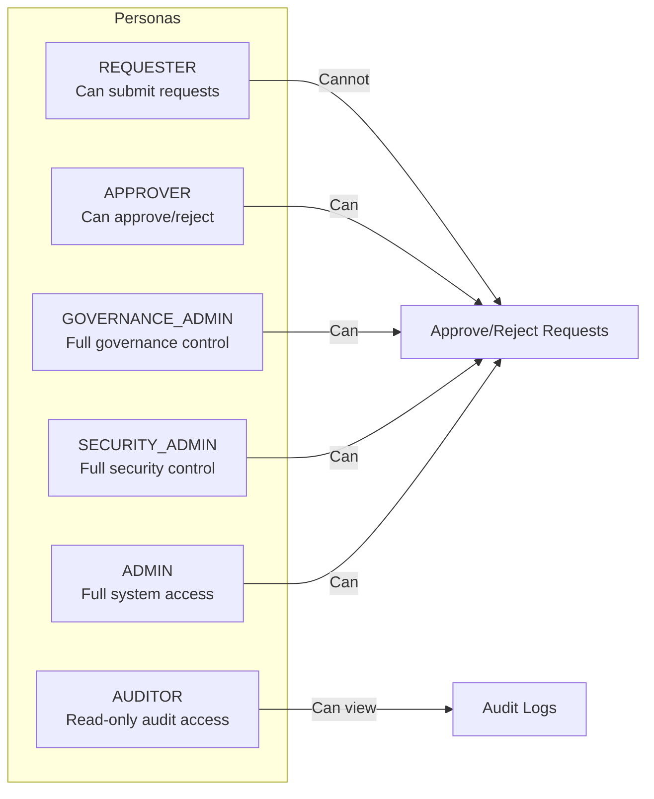

# Access Control Service - Architecture Documentation

## Overview
The Access Control Service (ACS) is a centralized security and governance middleware designed to manage access policies across heterogeneous data catalogs (Databricks Unity Catalog, Hive Metastore, Glue, etc.) and identity providers (Keycloak, Okta, Azure AD).

## System Context (C4 Level 1)

## Container Architecture (C4 Level 2)

## Component Diagram (C4 Level 3)

## Authentication Flow (OIDC + BFF)
ACS uses a Backend-for-Frontend (BFF) pattern with dynamic OIDC discovery for production environments, while maintaining a Mock IdP for testing.

## Persona Resolution Strategy (UML Activity)

## Domain Model (UML Class Diagram)

## Persona-Based RBAC Model

## Configuration
Authentication is configured via environment variables:

| Variable | Description | Example |
|:---|:---|:---|
| `OIDC_AUTH_SERVER_URL` | The discovery endpoint for the OIDC IdP | `http://keycloak:8080/realms/acs` |
| `OIDC_CLIENT_ID` | The registered OIDC client ID | `acs-backend` |
| `OIDC_CLIENT_SECRET` | The OIDC client secret | (from K8s Secret) |
| `DB_URL` | PostgreSQL JDBC connection string | `jdbc:postgresql://pg:5432/acs` |
| `DB_USERNAME` | Database user | `acs` |
| `DB_PASSWORD` | Database password | (from K8s Secret) |

## Deployment
Managed via Helm (`src/main/helm/acs-backend`). The chart includes:
- **Init containers** for database readiness (`waitOnStart`).
- **ConfigMaps** for environment-specific OIDC and catalog settings.
- **Secrets** for DB password, OIDC client secret, and optional PEM keys.
- **HPA** integration for horizontal auto-scaling.
- **Ingress** and **Gateway API HTTPRoute** support.
- **Resource limits** (256Mi–512Mi memory, 100m–500m CPU).
