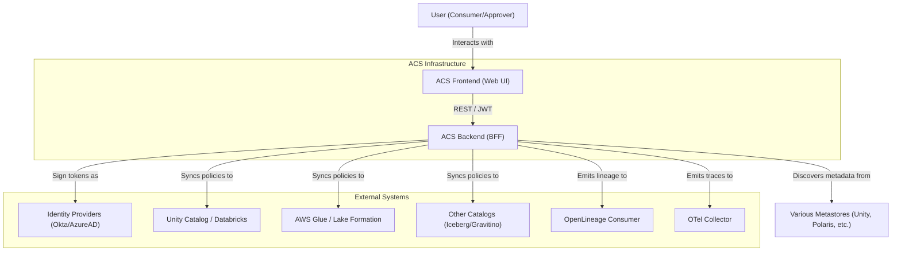
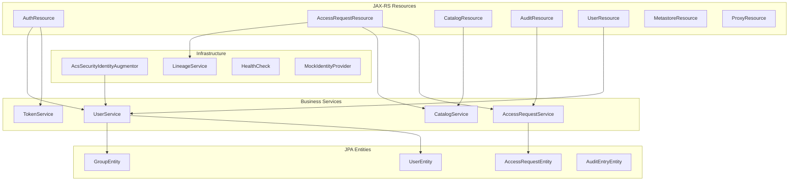
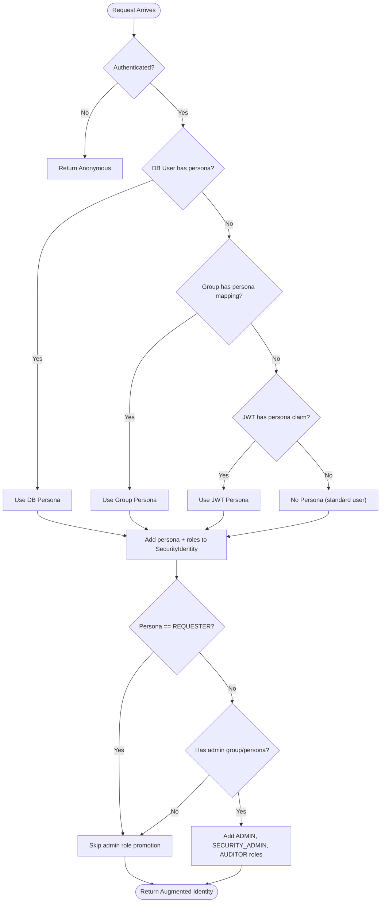
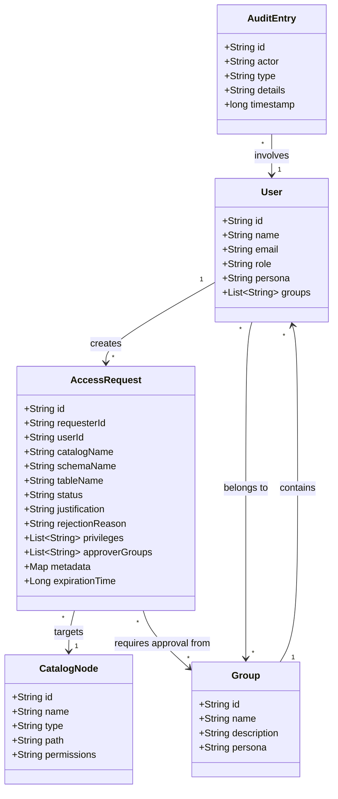

# Architecture Documentation

This page provides a high-level overview of the ACS Backend architecture using C4 and UML diagrams.

## System Context (C4)

The following diagram illustrates how the ACS Backend (BFF) orchestrates access requests across various identity and catalog providers.

## Internal Architecture (C4 Level 3)

## Persona Resolution Strategy (UML Activity)

## Domain Model (UML Class Diagram)

## Generic Catalog Interface

The ACS Backend provides a pluggable architecture for interacting with various data catalogs. This is achieved through the `CatalogProvider` SPI (Service Provider Interface).

### Key Components:

*   **CatalogProvider**: The interface that all catalog implementations must satisfy.
*   **ServiceLoader**: Used to dynamically discover and load available catalog providers at runtime.
*   **Common Domain**: Unified `CatalogNode` and `NodeType` definitions allow for a consistent experience across different catalog backends.

Available implementations include:
*   **UnityCatalogNodeProvider**
*   **GlueNodeProvider**
*   **DatabricksNodeProvider**
*   **IcebergNodeProvider**
*   **PolarisNodeProvider**
*   **DataHubNodeProvider**
*   **GravitinoNodeProvider**
*   **AtlanNodeProvider**
*   **HiveMetastoreNodeProvider**

## Metastore Discovery

The system provides an enhanced metadata discovery API (`/api/metastores/`) tailored for deep catalog exploration. Key features include:
*   **Recursive Fetching**: Support for a `depth` parameter to fetch children multiple levels deep in a single request.
*   **Fully-Qualified Paths**: All results are returned as a flat list of paths with associated metadata.
*   **Pagination**: Built-in support for paginating large nodes using `page_token` and `next_page_token`.

## Technical Stack

*   **Runtime**: Quarkus (Java 17)
*   **API**: REST with JAX-RS (RestEasy Reactive)
*   **Security**: SmallRye JWT
*   **Observability**: SmallRye Health & Micrometer Prometheus
*   **Testing**: JUnit 5, RestAssured, Cucumber

## Observability

The system implements advanced observability using two key frameworks:

### OpenTelemetry (OTel)
Used for distributed tracing. Every request to the BFF is automatically traced, providing visibility into the full request lifecycle from the frontend to backend and downstream proxies.

### OpenLineage
Used for tracking data and process flows. When an access request is submitted, approved, or rejected, a lineage event is emitted to capture the transition of metadata between the user and the Unity Catalog datasets.
