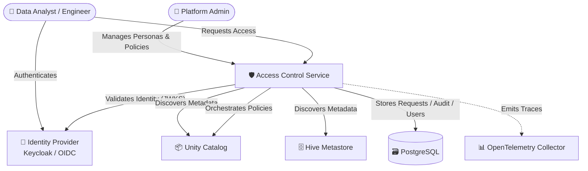
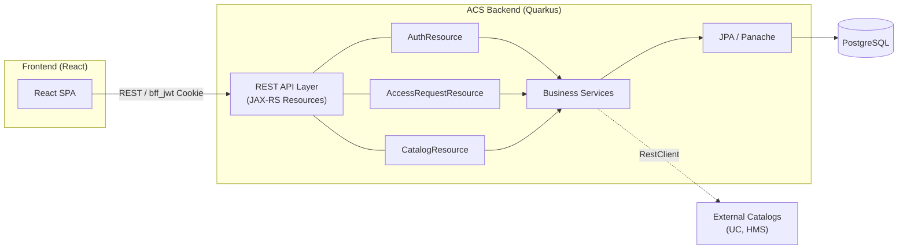
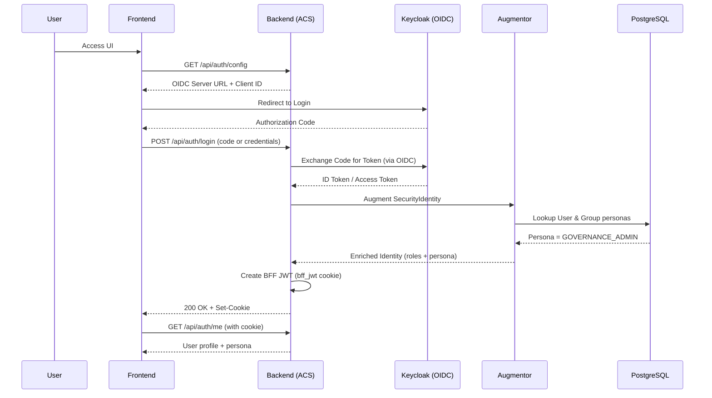

# Access Control Service - Architecture Documentation

## Overview
The Access Control Service (ACS) is a centralized security and governance middleware designed to manage access policies across heterogeneous data catalogs (Databricks Unity Catalog, Hive Metastore, Glue, etc.) and identity providers (Keycloak, Okta, Azure AD).

## System Context (C4 Level 1)
The following diagram illustrates the relationship between users, the ACS project, and external infrastructure (Identity Providers and Data Catalogs).

## Container Architecture (C4 Level 2)
ACS is composed of a React-based frontend and a Quarkus-based backend. The backend acts as a **Backend-for-Frontend (BFF)**, handling OIDC complexity and policy orchestration.

## Authentication Flow (OIDC + BFF)
ACS uses a Backend-for-Frontend (BFF) pattern with dynamic OIDC discovery for production environments, while maintaining a Mock IdP for testing.

## Module Documentation
For detailed implementation details, please refer to the specific module documentation:
- **[ACS Backend](backend/index.html)**: Internal components, SPIs, and domain models.
- **[ACS Frontend](frontend/index.html)**: UI components and state management.
- **[ACS Deployment](helm/index.html)**: Helm charts and Kubernetes configuration.
